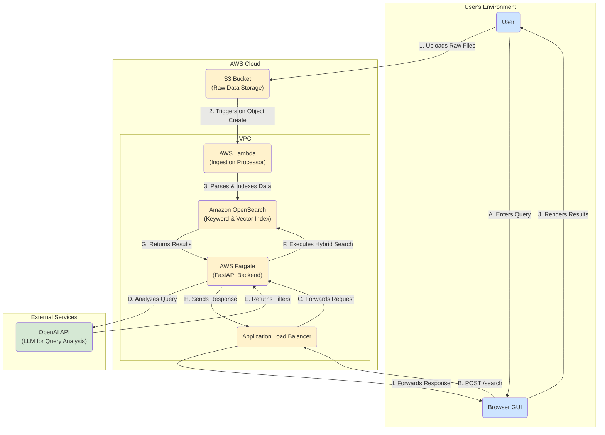

# AI-Powered User Search Engine


This project is a solution to the Neon Security technical challenge. It's a fully functional, AI-powered search engine that allows users to perform natural language queries against heterogeneous data sources (text, CSV, JSON) to find relevant user profiles.

The system is built on a scalable, event-driven AWS architecture and features a modern web interface for interaction.

## Features

* **Natural Language Querying:** Ask questions in plain English (e.g., "software engineers in California").
* **Hybrid Search:** Combines keyword-based filtering with AI-powered semantic vector search for highly relevant and accurate results.
* **LLM-Powered Query Analysis:** Uses models like GPT-3.5 to understand user intent and extract structured search criteria.
* **Heterogeneous Data Ingestion:** Automatically processes and normalizes data from `.txt`, `.csv`, and `.json` files uploaded to S3.
* **Scalable Cloud Architecture:** Built on serverless and managed AWS services (Lambda, Fargate, OpenSearch) designed to handle millions of users.
* **Infrastructure as Code:** The entire cloud infrastructure is defined using Terraform for repeatable, automated deployments.
* **Interactive Frontend:** A clean, responsive user interface to interact with the search engine.

## Architecture Overview




The system is composed of two main workflows: an asynchronous **Data Ingestion** pipeline and a synchronous **Query Execution** API.

1.  **Data Ingestion:** Files uploaded to an S3 bucket trigger a Lambda function. The Lambda parses the file, generates vector embeddings using a `sentence-transformer` model, and indexes the data into an Amazon OpenSearch cluster.
2.  **Query Execution:** A FastAPI application, running on AWS Fargate, receives the user's query. It uses an LLM (OpenAI) to extract structured filters, then executes a hybrid query against OpenSearch to retrieve the most relevant results.

## Tech Stack

* **Backend:** Python, FastAPI
* **Frontend:** HTML, Tailwind CSS, Vanilla JavaScript
* **AI/ML:**
    * OpenAI (GPT-3.5/4) for Query Understanding
    * `sentence-transformers` for Vector Embeddings
* **Database:** Amazon OpenSearch Service (for keyword and k-NN vector search)
* **Cloud Provider:** AWS
    * **Compute:** Lambda, Fargate
    * **Storage:** S3
    * **Networking:** VPC, Application Load Balancer
* **Infrastructure:** Terraform
* **Containerization:** Docker

## Getting Started

Follow these instructions to get the project up and running.

### Prerequisites

* An AWS Account with credentials configured locally.
* Terraform installed.
* Docker Desktop installed and running.
* Python 3.11+ and `pip`.
* An OpenAI API Key.

### 1. Clone the Repository & Install Dependencies

```bash
git clone git@github.com:scancel/neon-search.git
cd neon-search

# Set up and activate a Python virtual environment
python -m venv .venv
source .venv/bin/activate

# Install Python dependencies
pip install -r requirements.txt
```

### 2. Configure Environment Variables

Create a `.env` file in the project root for your secrets and configuration.

```
# .env

# AWS & OpenSearch - get these from Terraform output or AWS console
OPENSEARCH_HOST='your-opensearch-domain-endpoint.es.amazonaws.com'
OPENSEARCH_USER='your-opensearch-master-user'
OPENSEARCH_PASSWORD='YourStrongP@ssw0rd!'

# OpenAI API Key
OPENAI_API_KEY='sk-...'
```

### 3. Cloud Deployment (AWS with Terraform)

You can deploy the AWS infrastructure using the provided Terraform scripts.

**a. Create a `terraform.tfvars` file:**

```terraform
# terraform.tfvars

aws_region = "us-east-1"
opensearch_master_user = "neouser"
opensearch_master_password = "YourStrongP@ssw0rd!" # Must match .env
ecr_image_uri = "YOUR_ECR_IMAGE_URI" # You will fill this in after the next step
```

**b. Build and Push the Docker Image:**

First, run Terraform to create just the ECR repository.

```bash
terraform init
terraform apply -target=aws_ecr_repository.api_repo
```

Now, build and push the Docker image. The `repository_url` will be in the Terraform output.

```bash
# Get the repository URL from the output
export REPO_URL=$(terraform output -raw ecr_repository_url)

# Log in to AWS ECR
aws ecr get-login-password --region us-east-1 | docker login --username AWS --password-stdin $REPO_URL

# Build and tag your Docker image
docker build -t $REPO_URL:latest .

# Push the image to ECR
docker push $REPO_URL:latest
```

**c. Update `terraform.tfvars`:**
Now that you have the image URI, update the `ecr_image_uri` variable in your `terraform.tfvars` file.

**d. Deploy Everything:**

```bash
# Package the Lambda function
cd tools && bash pack-lambda.sh

# Deploy all resources
terraform apply
```

### 4. Run Locally (for Development)

You can run the FastAPI server locally for quick development and testing.

```bash
# Ensure your .env file is configured
source .venv/bin/activate
uvicorn app.main:app --reload
```

The application will be available at `http://127.0.0.1:8000`.

### 5. Ingest Data

To populate your search engine, upload your `.txt`, `.csv`, or `.json` files to the S3 bucket created by Terraform. The Lambda function will automatically process and index them.

## Full Local Development Setup (Docker)

This is the recommended way to run the project for local development. It uses Docker Compose to create a self-contained environment that mirrors the cloud architecture without any AWS costs.

### Prerequisites

* Docker Desktop installed and running.
* An OpenAI API Key.

### 1. Prepare Environment

**a. Create `.env.local` file:**
Create a file named `.env.local` in the project root. This will hold your local configuration.

```
# .env.local
OPENSEARCH_HOST=opensearch
OPENSEARCH_USER=
OPENSEARCH_PASSWORD=
AWS_ENDPOINT_URL=http://localstack:4566
OPENAI_API_KEY=sk-...
```

**b. Package the Lambda function:**
The `docker-compose.yml` file needs a zipped version of the ingestion code.

```bash
# Ensure you are in the project root
cd tools && bash pack-lambda.sh
```

### 2. Run the Environment

Start all services (API, OpenSearch, LocalStack) in the background.

```bash
docker-compose up -d --build
```
* The first time you run this, it will download the necessary Docker images, which may take a few minutes.
* You can view logs for all services with `docker-compose logs -f`.

### 3. Ingest Data Locally

To populate your local OpenSearch instance, use the `local_ingest.py` script. This script uploads a file to the local S3 (in LocalStack), which in turn triggers the local Lambda function.

```bash
# Example: Ingest a sample CSV file
python tools/local_ingest.py data/users.csv
```

### 4. Access the Application

* **GUI:** Open your browser to `http://localhost:8000`
* **API Docs:** `http://localhost:8000/docs`
* **OpenSearch:** `http://localhost:9200` (You can use this to directly inspect your index)

### 5. Shut Down the Environment

When you're finished, you can stop and remove the containers.

```bash
docker-compose down
```

---


## API Usage

The primary endpoint is `/search`. You can interact with it via the GUI or by sending a `POST` request.

* **URL:** `/search`
* **Method:** `POST`
* **Body:**
    ```json
    {
      "query_text": "data scientists in Germany",
      "top_k": 5
    }
    